# AI-OpenCog Package Analysis - Comprehensive Design

## Overview

The `@theia/ai-opencog` package represents the core cognitive AI integration component within the Cogtheia platform. This package transforms Eclipse Theia into a cognitive-powered development environment by integrating OpenCog's symbolic AI framework with the IDE's extensible architecture. The implementation spans six complete development phases, providing comprehensive cognitive capabilities including reasoning, learning, knowledge management, and multi-modal processing.

## Technology Stack & Dependencies

### Core Dependencies

- **@theia/ai-chat**: AI chat functionality integration
- **@theia/ai-core**: Foundation AI services and interfaces
- **@theia/core**: Theia platform core framework
- **@theia/workspace**: Workspace management services
- **@theia/editor**: Editor integration layer
- **@theia/filesystem**: File system operations
- **@theia/monaco**: Monaco editor integration
- **@theia/variable-resolver**: Variable resolution services

### Development Infrastructure

- **TypeScript**: Type-safe development with version ~5.4.5
- **Lerna**: Monorepo package management
- **Docker**: Production deployment containerization
- **Node.js**: Backend runtime (≥20 required)

## Architecture

### Component Hierarchy

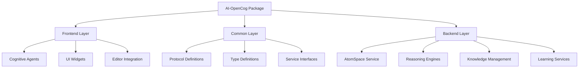

### Layered Architecture Design

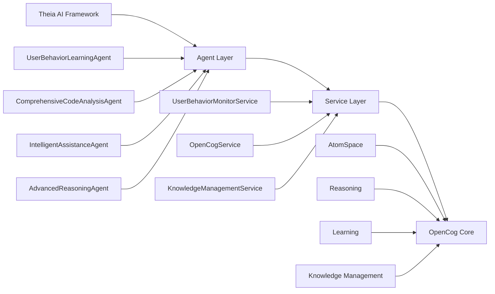

## Component Architecture

### Frontend Components (Browser Layer)

#### Cognitive Agents

- **ComprehensiveCodeAnalysisAgent**: Deep semantic code analysis with real-time feedback
- **IntelligentAssistanceAgent**: Context-aware development assistance and learning guidance
- **AdvancedReasoningAgent**: Complex problem-solving with multi-step cognitive reasoning
- **UserBehaviorLearningAgent**: Behavior analysis and adaptive personalization

#### Sensor-Motor System

- **ActivitySensor**: Tracks user interactions across the IDE
- **CodeChangeSensor**: Monitors code modifications and editing patterns
- **EnvironmentSensor**: Captures workspace and project context
- **CodeModificationActuator**: Enables automated code modifications
- **ToolControlActuator**: Controls IDE tools and features
- **EnvironmentManagementActuator**: Manages workspace configuration

#### UI Integration

- **Cognitive Widgets**: Specialized UI components for cognitive features
- **Real-time Analyzer**: Live code analysis and feedback
- **Production Monitoring Widget**: Performance and usage analytics

### Common Layer (Shared Interfaces)

#### Protocol Definitions

The common layer defines JSON-RPC protocol extensions for OpenCog operations:

```typescript
interface OpenCogProtocol {
    // AtomSpace operations
    'opencog/add-atom': { atom: Atom };
    'opencog/query-atoms': { pattern: AtomPattern };
    'opencog/reason': { query: ReasoningQuery };
    'opencog/learn': { data: LearningData };
    'opencog/recognize-patterns': { input: PatternInput };
    
    // Distributed reasoning
    'distributed-reasoning/submit-task': { query: ReasoningQuery };
    'distributed-reasoning/get-task-status': { taskId: string };
}
```

#### Type System

Comprehensive type definitions supporting:
- **Atoms**: Basic knowledge representation units
- **Truth Values**: Probabilistic confidence scoring
- **Attention Values**: Cognitive importance metrics
- **Learning Data**: Multi-modal training information
- **Pattern Recognition**: Code and behavioral pattern types

### Backend Services (Node Layer)

#### AtomSpace Service

Core knowledge storage and management system implementing OpenCog's AtomSpace:

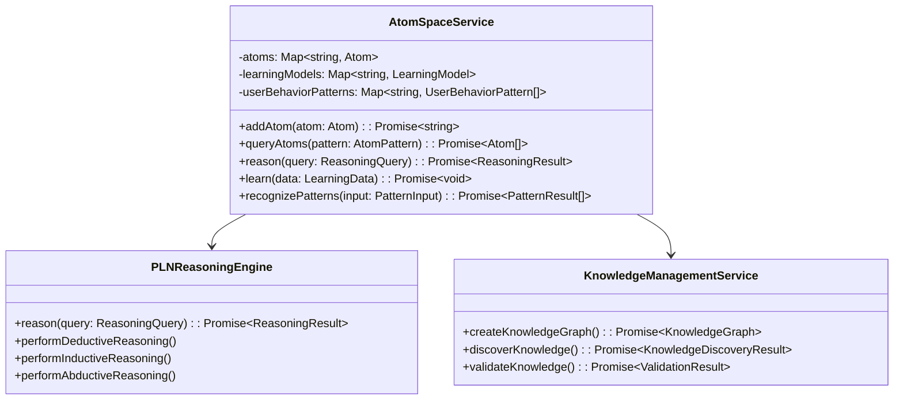

#### Reasoning Engines

Specialized cognitive processing engines:

- **PLNReasoningEngine**: Probabilistic Logic Networks for deductive/inductive/abductive reasoning
- **PatternMatchingEngine**: Advanced pattern recognition and matching
- **CodeAnalysisReasoningEngine**: Code-specific reasoning and analysis

#### Learning Services

Advanced learning and adaptation systems:
- **SupervisedLearningService**: Labeled data training
- **UnsupervisedLearningService**: Pattern discovery and clustering
- **ReinforcementLearningService**: Reward-based learning
- **MultiModalProcessingService**: Cross-modal data processing

## Data Flow & Integration Patterns

### Real-time Cognitive Analysis Flow

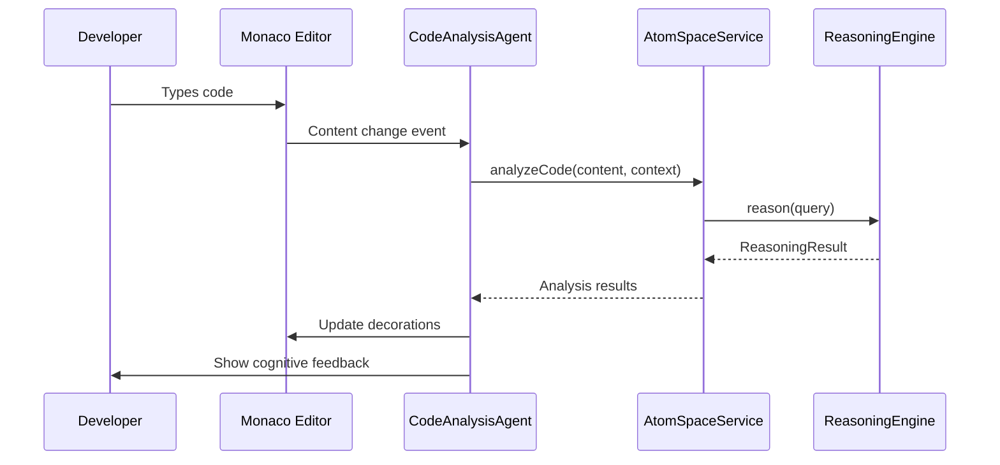

### Learning and Adaptation Flow

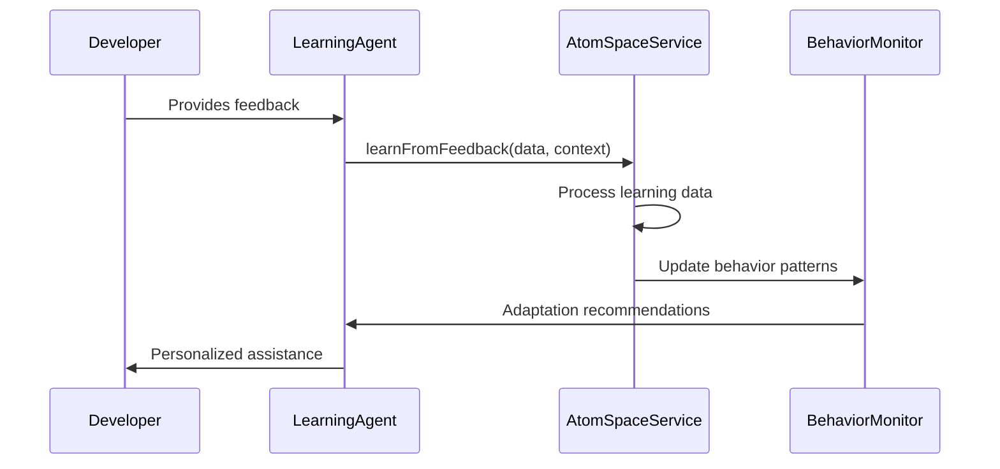

## Multi-Modal Processing Capabilities

### Phase 5 Implementation

The package includes comprehensive multi-modal cognitive processing:

#### Modality Types Supported

- **Text**: Code, documentation, comments
- **Visual**: IDE layouts, visual patterns
- **Audio**: Voice commands, audio feedback
- **Structured**: AST, dependency graphs

#### Tensor Operations

Support for 3D and 4D tensor operations enabling complex cognitive processing:

```typescript
interface TensorData {
    shape: number[];
    data: number[];
    dtype: 'float32' | 'int32' | 'boolean';
    metadata?: Record<string, any>;
}

interface Tensor3D extends TensorData {
    width: number;
    height: number;
    depth: number;
}
```

## Advanced Learning Algorithms

### Learning Types Implemented

- **Neural Networks**: Deep learning with configurable architectures
- **Meta-Learning**: Few-shot learning adaptation
- **Transfer Learning**: Knowledge transfer between domains
- **Ensemble Learning**: Multiple model combination
- **Online Learning**: Continuous adaptation
- **Active Learning**: Strategic sample selection

### Configuration Examples

```typescript
interface NeuralNetworkConfig {
    architecture: 'feedforward' | 'convolutional' | 'recurrent' | 'transformer';
    layers: LayerConfig[];
    optimizer: 'adam' | 'sgd' | 'rmsprop';
    learningRate: number;
    batchSize: number;
}

interface MetaLearningConfig {
    algorithm: 'maml' | 'prototypical' | 'relation' | 'matching';
    innerSteps: number;
    outerSteps: number;
    supportSize: number;
    querySize: number;
}
```

## Knowledge Management System

### Knowledge Graph Architecture

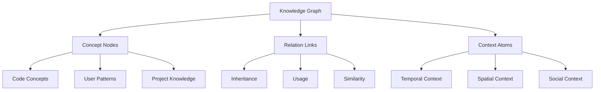

### Knowledge Operations

- **Graph Creation**: Organize domain-specific knowledge
- **Knowledge Discovery**: Find related concepts and patterns
- **Validation**: Ensure consistency and quality
- **Categorization**: Organize into domains and hierarchies
- **Persistence**: Save/load with versioning support

## Production Deployment Features

### Docker Integration

Complete containerization support with:
- **Dockerfile**: Production container configuration
- **docker-compose.production.yml**: Multi-service orchestration
- **Build Scripts**: Automated container building
- **Health Checks**: Service monitoring and validation

### Monitoring and Analytics

- **Production Monitoring**: Real-time system performance
- **Resource Management**: Memory and CPU optimization
- **Analytics Dashboard**: Usage patterns and insights
- **Performance Optimization**: Caching and efficiency tuning

## Testing Strategy

### Test Coverage Distribution

- **Total Tests**: 100+ comprehensive test cases
- **AtomSpace Service**: 32 tests covering core operations
- **Reasoning Engines**: 31 tests for cognitive processing
- **Knowledge Management**: 19 tests for graph operations
- **Learning Systems**: 25+ tests for adaptation features
- **Integration Tests**: End-to-end workflow validation

### Test Categories

- **Unit Tests**: Individual component validation
- **Integration Tests**: Service interaction testing
- **Cognitive Tests**: Reasoning accuracy validation
- **Performance Tests**: Scalability and efficiency
- **User Behavior Tests**: Learning and adaptation verification

## Performance Optimization

### Caching Strategies

- **Cognitive Analysis Cache**: Debounced real-time processing
- **Pattern Recognition Cache**: Frequently used patterns
- **Learning Model Cache**: Trained model persistence
- **Knowledge Graph Cache**: Optimized graph traversal

### Scalability Features

- **Distributed Reasoning**: Multi-node cognitive processing
- **Asynchronous Operations**: Non-blocking cognitive tasks
- **Resource Management**: Memory and CPU optimization
- **Load Balancing**: Intelligent task distribution

## SKZ Framework Compliance

### Autonomous Agent Architecture

Full compliance with SKZ framework requirements:
- **Agent-Based Design**: Proper Theia Agent interface implementation
- **Service Integration**: Clean dependency injection patterns
- **Event-Driven Learning**: Reactive behavioral analysis
- **Autonomous Adaptation**: Dynamic workflow optimization

### Agent Capabilities

- **Context Awareness**: Understanding development environment
- **Learning Adaptation**: Continuous improvement from interactions
- **Collaborative Intelligence**: Team knowledge sharing
- **Autonomous Decision Making**: Independent cognitive processing

## API Reference

### Core Service Methods

```typescript
interface OpenCogService {
    // AtomSpace Operations
    addAtom(atom: Atom): Promise<string>;
    queryAtoms(pattern: AtomPattern): Promise<Atom[]>;
    reason(query: ReasoningQuery): Promise<ReasoningResult>;
    
    // Learning and Adaptation
    learn(data: LearningData): Promise<void>;
    learnFromFeedback(feedback: UserFeedback, context: LearningContext): Promise<void>;
    adaptToUser(userId: string, domain: string, data: any): Promise<AdaptationStrategy>;
    
    // Pattern Recognition
    recognizePatterns(input: PatternInput): Promise<PatternResult[]>;
    
    // Multi-Modal Processing
    processMultiModalData(data: MultiModalData): Promise<MultiModalData>;
    recognizeMultiModalPatterns(input: MultiModalPatternInput): Promise<MultiModalPatternResult[]>;
    
    // Advanced Learning
    trainAdvancedModel(data: AdvancedLearningData): Promise<AdvancedLearningResult>;
    createNeuralNetwork(config: NeuralNetworkConfig): Promise<AdvancedLearningModel>;
}
```

## Integration Examples

### Real-time Code Analysis

```typescript
// Setup cognitive analysis agent
const codeAnalysisAgent = new ComprehensiveCodeAnalysisAgent(
    openCogService, 
    knowledgeService, 
    workspaceService, 
    editorManager
);

// Get comprehensive analysis
const analysis = await codeAnalysisAgent.analyzeCode(
    'function-analysis',
    codeText,
    { includeMetrics: true, suggestImprovements: true }
);

// Apply real-time feedback
await codeAnalysisAgent.applyRealtimeFeedback(editor, analysis);
```

### User Behavior Learning

```typescript
// Initialize behavior learning
const behaviorAgent = new UserBehaviorLearningAgent(openCogService);

// Track user interaction
await behaviorAgent.recordUserInteraction('user123', {
    action: 'code-completion-accepted',
    context: { language: 'typescript', function: 'async' },
    timestamp: Date.now()
});

// Get personalized recommendations
const recommendations = await behaviorAgent.getBehaviorRecommendations('user123');
```

### Advanced Problem Solving

```typescript
// Complex reasoning for architectural decisions
const solution = await reasoningAgent.solveComplexProblem({
    title: 'Design scalable microservices architecture',
    domain: 'architecture',
    complexity: 'high',
    constraints: ['budget', 'timeline'],
    goals: ['scalability', 'maintainability']
});
```

## Implementation & Action Flow

### Module Initialization Flow

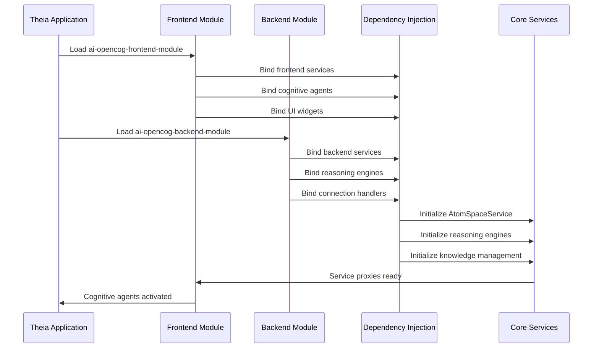

### Cognitive Agent Activation Flow

#### Phase 1: Agent Registration

```typescript
// Frontend module binds agents to container
bind(Symbol.for('Agent')).to(ComprehensiveCodeAnalysisAgent).inSingletonScope();
bind(Symbol.for('Agent')).to(IntelligentAssistanceAgent).inSingletonScope();
bind(Symbol.for('Agent')).to(UserBehaviorLearningAgent).inSingletonScope();
bind(Symbol.for('Agent')).to(AdvancedReasoningAgent).inSingletonScope();
```

#### Phase 2: Service Initialization

```typescript
@injectable()
export class ComprehensiveCodeAnalysisAgent extends Agent {
    constructor(
        @inject(OpenCogService) private readonly openCogService: OpenCogService,
        @inject(KnowledgeManagementService) private readonly knowledgeService: KnowledgeManagementService,
        @inject(EditorManager) private readonly editorManager: EditorManager
    ) {
        super('comprehensive-cognitive-code-analysis', 'Advanced cognitive analysis');
        this.initializeCognitiveInfrastructure();
    }
}
```

### Real-time Cognitive Processing Flow

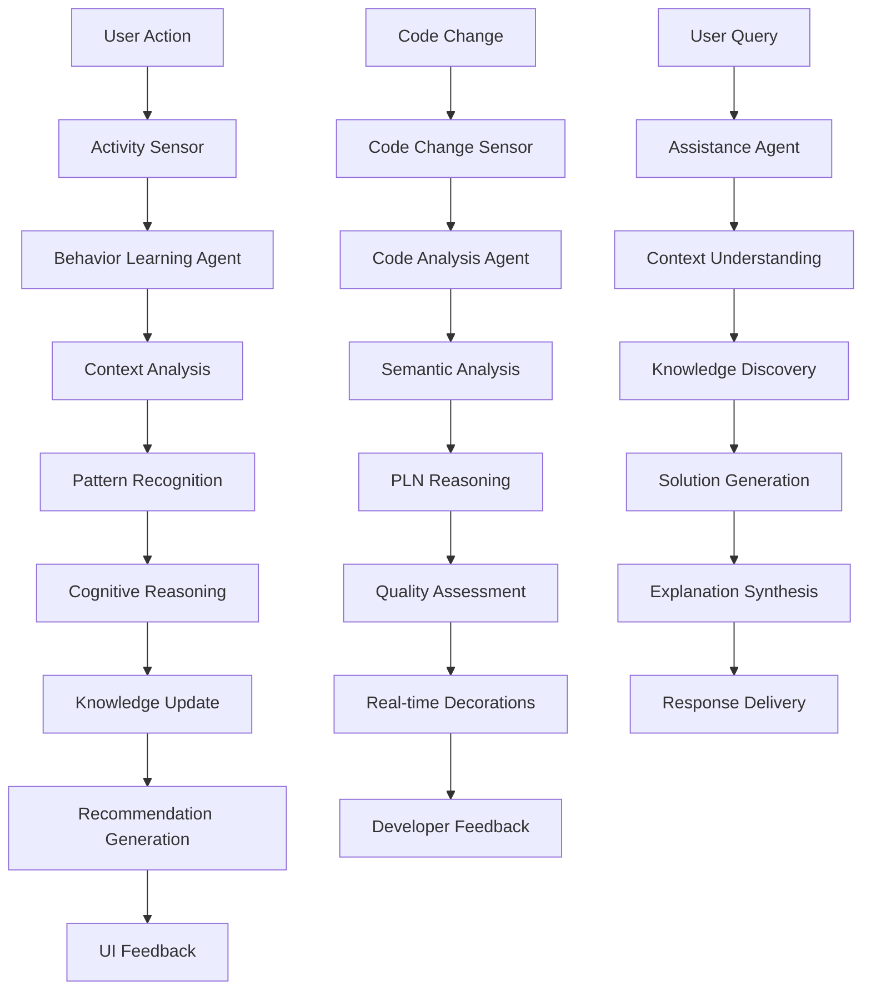

### Sensor-Motor System Action Flow

#### Activity Monitoring Pipeline

```typescript
// Activity Sensor captures user interactions
class ActivitySensor {
    private setupEditorMonitoring(): void {
        this.editorManager.onCurrentEditorChanged(widget => {
            this.recordActivity({
                type: 'navigate',
                details: { action: 'switch-editor', uri: widget.editor.uri.toString() },
                timestamp: Date.now()
            });
        });
    }
    
    private recordActivity(activity: UserActivity): void {
        // Store in local history
        this.activityHistory.push(activity);
        
        // Send to OpenCog for learning
        this.opencog.learn({
            type: 'behavioral',
            input: activity,
            context: { sensor: 'activity', realtime: true }
        });
    }
}
```

#### Code Modification Actuator

```typescript
class CodeModificationActuator {
    async applyCodeSuggestion(suggestion: CodeSuggestion): Promise<boolean> {
        const editor = this.editorManager.currentEditor;
        if (!editor) return false;
        
        // Apply modification with cognitive reasoning
        const modification = {
            range: suggestion.range,
            text: suggestion.newText,
            reasoning: suggestion.cognitiveReasoning
        };
        
        await this.editorService.applyEdit(editor.uri, modification);
        
        // Learn from application success
        await this.learningService.recordSuccess(suggestion, modification);
        
        return true;
    }
}
```

### Reasoning Engine Processing Flow

#### PLN Reasoning Pipeline

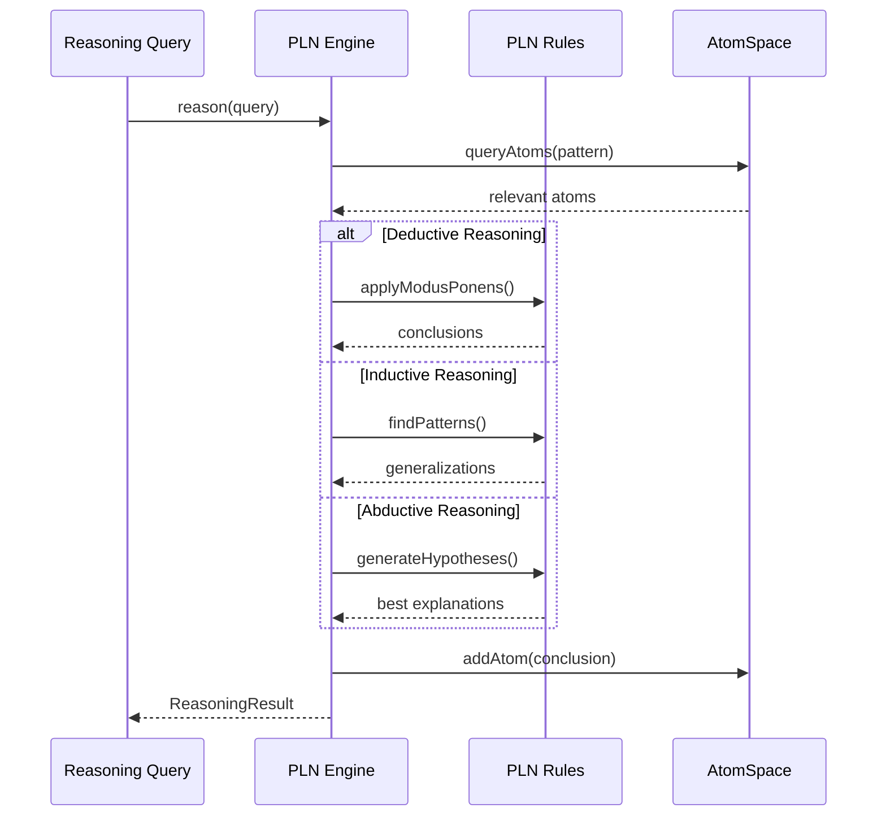

#### Code Analysis Reasoning

```typescript
class CodeAnalysisReasoningEngine {
    async analyzeCodeQuality(code: string, context: any): Promise<ReasoningResult> {
        // Extract AST and semantic information
        const ast = this.parseCode(code, context.language);
        const semantics = this.extractSemantics(ast);
        
        // Create cognitive atoms for reasoning
        const codeAtoms = this.createCodeAtoms(semantics);
        
        // Apply quality analysis rules
        const qualityRules = await this.getQualityRules(context.language);
        const analysis = this.applyQualityRules(codeAtoms, qualityRules);
        
        // Generate recommendations
        const recommendations = this.generateRecommendations(analysis);
        
        return {
            conclusion: recommendations,
            confidence: this.calculateConfidence(analysis),
            explanation: this.generateExplanation(analysis),
            metadata: { codeComplexity: semantics.complexity, language: context.language }
        };
    }
}
```

### Learning and Adaptation Action Flow

#### User Behavior Learning Process

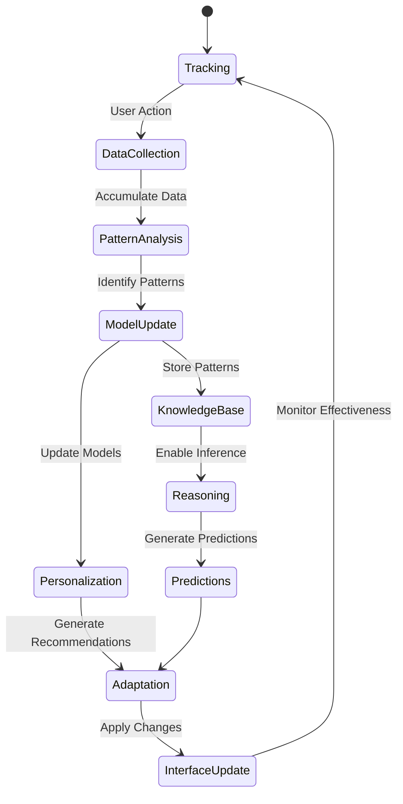

#### Learning Implementation

```typescript
class UserBehaviorLearningAgent {
    async trackUserBehavior(userId: string, action: string, context: any): Promise<void> {
        const behavior: UserBehavior = {
            userId, sessionId: this.activeSessionId!,
            timestamp: Date.now(), action, context
        };
        
        // Store locally for analysis
        this.userSessions.get(userId)?.push(behavior) || this.userSessions.set(userId, [behavior]);
        
        // Learn from behavior using OpenCog
        await this.learnFromBehavior(behavior);
        
        // Update analytics and predictions
        await this.updateBehaviorAnalytics(userId, behavior);
        await this.predictNextUserAction(userId, context);
    }
    
    private async learnFromBehavior(behavior: UserBehavior): Promise<void> {
        const learningData: LearningData = {
            type: 'behavioral',
            input: behavior,
            context: {
                userId: behavior.userId,
                sessionId: behavior.sessionId,
                interactionType: 'user-behavior'
            },
            timestamp: behavior.timestamp
        };
        
        await this.openCogService.learn(learningData);
    }
}
```

### Knowledge Management Action Flow

#### Knowledge Graph Operations

```typescript
class KnowledgeManagementServiceImpl {
    async createKnowledgeGraph(name: string, domain: string, description: string): Promise<KnowledgeGraph> {
        const graph: KnowledgeGraph = {
            id: this.generateGraphId(),
            name, domain, description,
            atoms: [], relationships: [],
            createdAt: Date.now(), updatedAt: Date.now()
        };
        
        this.knowledgeGraphs.set(graph.id, graph);
        
        // Create root concept in AtomSpace
        const rootConcept: Atom = {
            type: 'ConceptNode',
            name: `knowledge-graph-${graph.id}`,
            truthValue: { strength: 1.0, confidence: 1.0 },
            metadata: { graphId: graph.id, domain }
        };
        
        await this.atomSpaceService.addAtom(rootConcept);
        graph.atoms.push(rootConcept);
        
        return graph;
    }
}
```

### Multi-Modal Processing Flow

#### Cross-Modal Data Processing

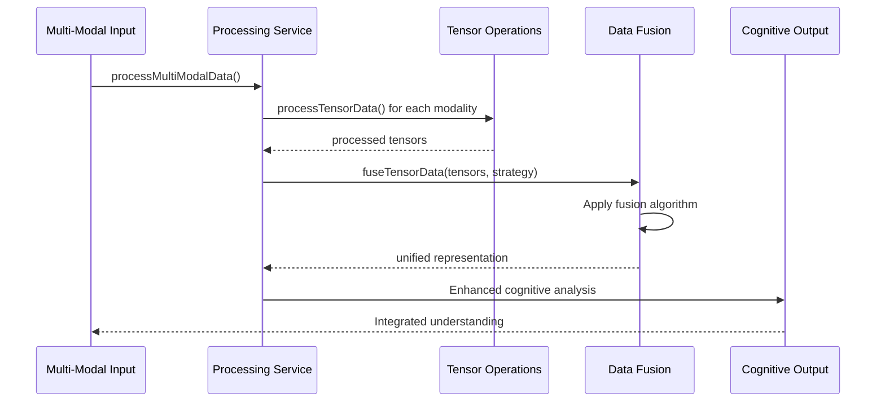

### Production Deployment Action Flow

#### Container Orchestration

```yaml
# docker-compose.production.yml
version: '3.8'
services:
  theia-opencog:
    build: .
    ports:
      - "3000:3000"
    environment:
      - NODE_ENV=production
      - OPENCOG_DISTRIBUTED=true
    volumes:
      - knowledge-data:/app/data
    depends_on:
      - reasoning-cluster
      
  reasoning-cluster:
    image: opencog/reasoning-node
    replicas: 3
    environment:
      - CLUSTER_MODE=distributed
```

#### Performance Monitoring

```typescript
class ProductionMonitoringService {
    async collectPerformanceMetrics(): Promise<PerformanceMetrics> {
        return {
            cognitiveOperations: await this.measureCognitivePerformance(),
            memoryUsage: await this.getMemoryMetrics(),
            reasoningLatency: await this.measureReasoningLatency(),
            learningEfficiency: await this.calculateLearningMetrics(),
            userSatisfaction: await this.getUserFeedbackMetrics()
        };
    }
}
```

### Error Handling & Recovery Flow

#### Cognitive Operation Resilience

```typescript
class ResilientCognitiveService {
    async performResilientReasoning(query: ReasoningQuery): Promise<ReasoningResult> {
        try {
            return await this.primaryReasoningEngine.reason(query);
        } catch (primaryError) {
            console.warn('Primary reasoning failed, attempting fallback:', primaryError);
            
            try {
                return await this.fallbackReasoningEngine.reason(query);
            } catch (fallbackError) {
                console.error('All reasoning engines failed:', fallbackError);
                
                // Return degraded but safe response
                return {
                    conclusion: [],
                    confidence: 0,
                    explanation: 'Reasoning temporarily unavailable',
                    metadata: { error: true, degradedMode: true }
                };
            }
        }
    }
}
```

### Integration Testing Flow

#### End-to-End Cognitive Workflow

```typescript
describe('Cognitive Workflow Integration', () => {
    it('should complete full cognitive analysis cycle', async () => {
        // 1. User types code
        const codeInput = 'function calculateTotal(items) { return items.reduce((sum, item) => sum + item.price, 0); }';
        
        // 2. Activity sensor captures input
        await activitySensor.recordActivity({ type: 'edit', details: { action: 'code-input' } });
        
        // 3. Code analysis agent processes
        const analysis = await codeAnalysisAgent.analyzeCode('quality-analysis', codeInput);
        
        // 4. Reasoning engine generates insights
        const reasoning = await reasoningEngine.reason({
            type: 'code-analysis',
            context: { code: codeInput, language: 'javascript' }
        });
        
        // 5. Learning agent records patterns
        await learningAgent.learn({ type: 'supervised', input: analysis });
        
        // 6. User behavior agent adapts interface
        const adaptations = await behaviorAgent.adaptInterfaceForUser('user123');
        
        // Verify complete cognitive cycle
        expect(analysis).toBeDefined();
        expect(reasoning.confidence).toBeGreaterThan(0.5);
        expect(adaptations).toHaveLength.greaterThan(0);
    });
});
```

## Future Enhancement Opportunities

### Potential Extensions

- **Natural Language Processing**: Enhanced code comment analysis
- **Visual Code Understanding**: Diagram and flowchart integration
- **Collaborative Reasoning**: Multi-developer cognitive sessions
- **Cross-Language Support**: Enhanced polyglot development
- **Advanced Visualization**: Cognitive analysis dashboards

### Research Integration

- **Latest OpenCog Advances**: Incorporating new cognitive algorithms
- **Machine Learning Integration**: Hybrid symbolic-neural approaches
- **Quantum Computing**: Future quantum-classical cognitive processing
- **Neuromorphic Computing**: Brain-inspired processing patterns
